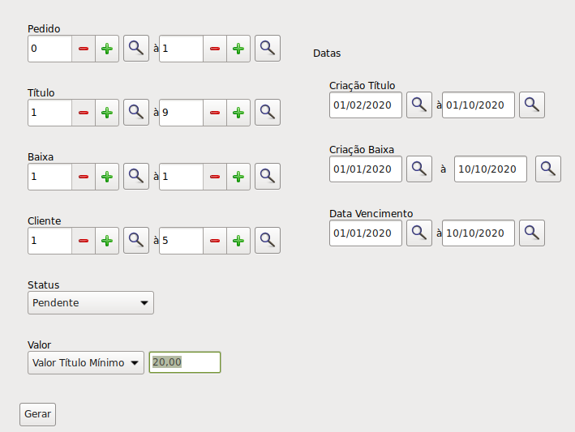

# Pedidos
> Sistema gerencial para pedidos.

Gere pedidos, controle seu estoque, acompanhe suas contas à pagar e receber

<ul>
<li>Faturamento</li>
<li>Compras</li>
<li>Estoque</li>
<li>Financeiro</li>
<li>Relatórios Gerais</li>
</ul>

## Cadastros básicos

Armazene dados como  cadastros de produtos, clientes, fornecedores de forma rápida, fácil contando com a segurança de um banco de dados com alta criptografia

## Controle estoque

Controle o saldo cada produto, tenha estoques ilimitados

Seja notificado quando o saldo de um produto estiver no limite definido ou acabando

Movimentação de estoque automática, no fechamento de pedidos

## Contas a Receber e Pagar

Mantenha-se atualizado com contas à pagar e receber de seus fornecedores ou clientes

Movimentação de financeiro automática, no fechamento de pedidos

Receba avisos de títulos a pagar e receber próximos do vencimento

## Notificações e Relatórios

Tenha uma visão detalhada da situação geral do seu comércio ou de suas despesas pessoais, a partir de relátorios fixos ou personalizados

Monte seus relatórios com os campos de sua preferencia ou necessidade

## Suporte direto

Comunique o suporte a respeito de erros, dúvidas, solicitações de forma fácil e rápida

## Instalação

### dependencias
<ul>
<li>GTK3</li>
<li>MariaDB</li>
<li>LibXML2</li>
</ul>

<h3>Linux:</h3>

sudo ./comp.sh

<h3>Windows:</h3>

comp.bat

Calisto – jovictor210@gmail.com

## Contribuindo

1. Fork (<https://github.com/Calistu/pedidos/fork>)
2. Crie seu branch (`git checkout -b feature/algo`)
3. Comite as alterações (`git commit -am 'Adicionando algo'`)
4. Suba como branch (`git push origin feature/algo`)
5. Crie um pull request
