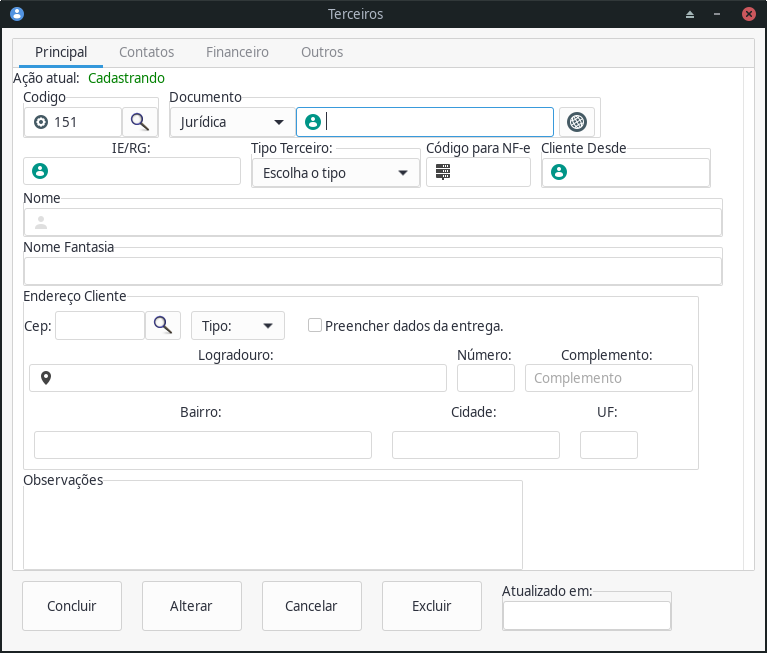

# Pedidos (EM DESENVOLVIMENTO - beta)
> Sistema gerencial.

[Pedidos Wiki - Saiba mais sobre o desenvolvimento do Projeto](https://github.com/stdmedoth/pedidos/wiki)

[Pages](https://stdmedoth.github.io/pedidos/)

[Trello - Desenvolvimento](https://trello.com/b/kX1scIYM/pedidos-software-v1)

[Documentação das Versões](https://drive.google.com/drive/folders/1oLtes6nGME0_u5Ye-cu01hSzJUTQAZlz?usp=sharing)

Software gerencial para controle de vendas, compras, financeiro, estoque e marketing

<ul>
<li>Vendas</li>
<li>Compras</li>
<li>Estoque</li>
<li>Financeiro</li>
<li>Marketing</li>
<li>Relatórios Gerais</li>
</ul>

## Cadastros básicos

Armazene dados como cadastros de produtos, clientes, fornecedores de forma rápida, fácil contando com a segurança de um banco de dados com alta criptografia

## Controle estoque

Controle o saldo de cada produto, tenha estoques ilimitados

Seja notificado quando o saldo de um produto estiver no saldo limite definido

Movimentação de estoque automática, no fechamento de pedidos

## Contas a Receber e Pagar

Mantenha-se atualizado com contas à pagar e receber de seus fornecedores ou clientes

Movimentação de financeiro automática, no fechamento de pedidos

Receba avisos de títulos a pagar e receber próximos do vencimento

## Notificações e Relatórios

Tenha uma visão detalhada da situação geral do seu comércio ou de suas despesas pessoais, a partir de relátorios fixos ou personalizados

Monte seus relatórios com os campos de sua preferencia ou necessidade

## Suporte direto

Comunique o suporte a respeito de erros, dúvidas, solicitações de forma fácil e rápida

## Instalação

### dependencias
<ul>
<li>GTK3</li>
<li>MariaDB</li>
<li>LibXML2</li>
</ul>

<h3>Linux:</h3>

make

sudo make install

<h3>Windows:</h3>

instalar mingw-gcc, mingw-gtk3, mingw-libxml2, mingw-libmariadb ou libmysql

MSYS2

https://www.msys2.org/

Build de Apps Gtk para windows
https://www.gtk.org/docs/installations/windows/

Mysql C API para Windows
https://dev.mysql.com/downloads/connector/cpp/

Curl C para Windows
https://curl.se/windows/

# Doação

Este é um projeto totalmente Open Source, para usá-lo, copiá-lo ou modificá-lo você não paga absolutamente nada. Porém para continuarmos a mantê-lo de forma adequada é necessária alguma contribuição seja feita, seja auxiliando na codificação, na documentação, na realização de testes e identificação de falhas e BUGs.

Mas também, caso você ache que qualquer informação obtida aqui, lhe foi útil e que isso vale algum dinheiro e está disposto a doar algo, sinta-se livre para enviar qualquer quantia, seja diretamente ao autor ou através do PayPal.

Calisto – jovictor210@gmail.com

## Contribuindo

1. Fork (<https://github.com/stdmedoth/pedidos/fork>)
2. Crie seu branch (`git checkout -b feature/algo`)
3. Comite as alterações (`git commit -am 'Adicionando algo'`)
4. Suba como branch (`git push origin feature/algo`)
5. Crie um pull request
